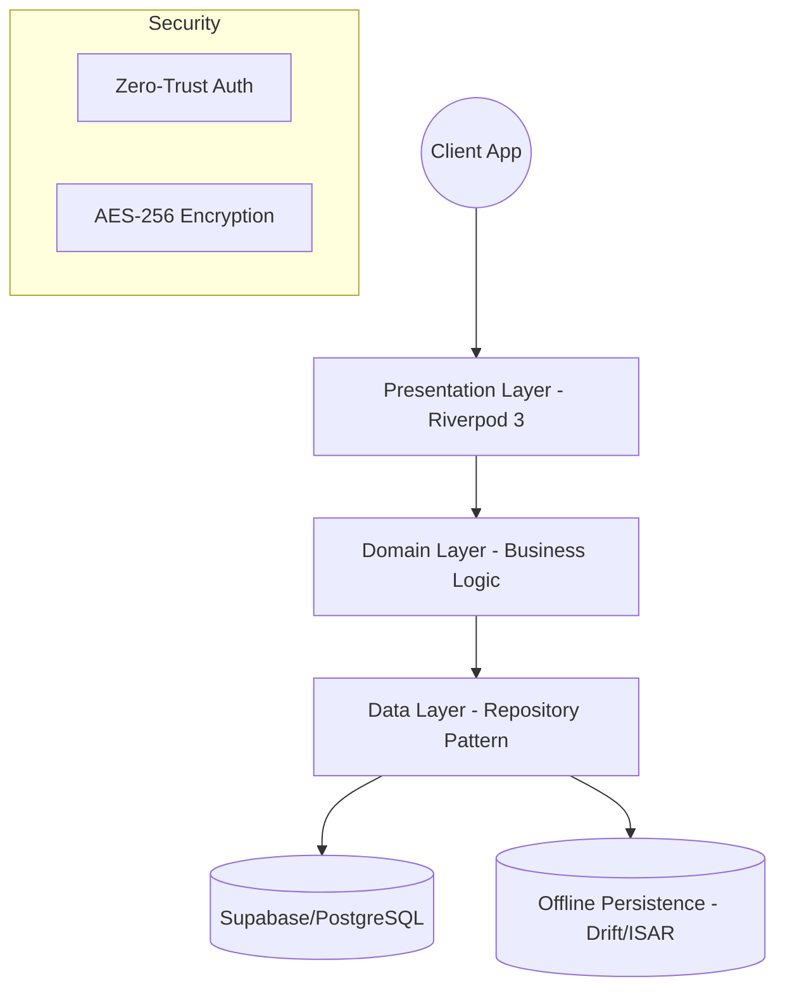

# 🏛️ Architecture & Engineering Manifesto

## Vision & Security Model
QRPRUF is designed as an institutional-grade proof-of-presence application. It strictly adheres to a **Zero-Trust** security model where the client device is responsible for establishing cryptographic proof before pushing it to the cloud.

## Clean Architecture Implementation
We use a feature-first variant of Clean Architecture to ensure separation of concerns:

- **Presentation Layer (`UI` + `Controllers`)**
  We utilize Riverpod 3.0 for all state management. UI widgets should be completely devoid of business logic. They consume StateProviders and trigger Methods on AsyncNotifierProviders.

- **Domain Layer (`Models` + `Entities`)**
  Pure Dart code. Does not know anything about Flutter, Supabase, or HTTP. Defines what an `Evidence` or a `Mission` is.

- **Data Layer (`Repositories` + `Services`)**
  Abstracts Supabase APIs, local SQLite, or device hardware (Camera/GPS). 

## High-Bar Engineering Standards
1. **No direct HTTP calls in UI**: All networking goes through injected services.
2. **Immutable State**: Freezed/Code Generation is strongly recommended for all state objects to prevent side effects.
3. **Test-Driven Design**: Core cryptographic verification and routing logic must have associated unit tests using `mocktail`.
4. **CI/CD Compliance**: No PR is reviewed unless the GitHub Actions Quality Gate is green (No warnings, strictly formatted).
