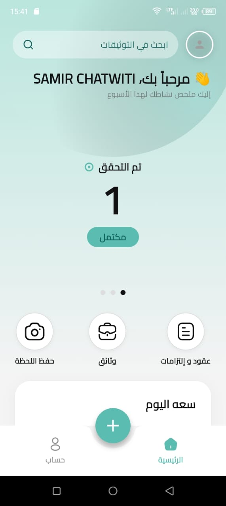
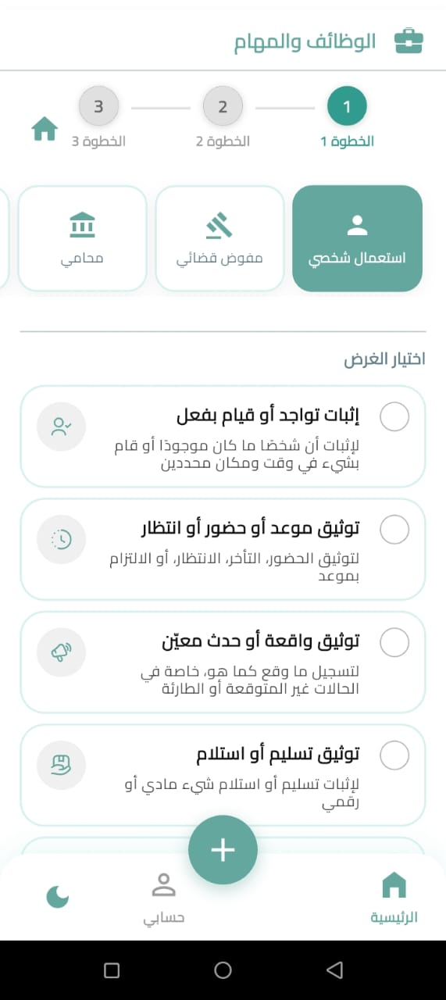
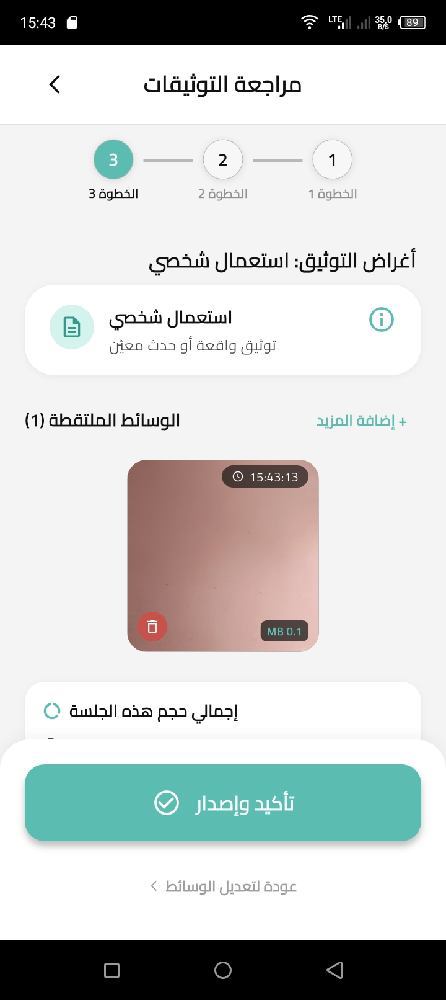
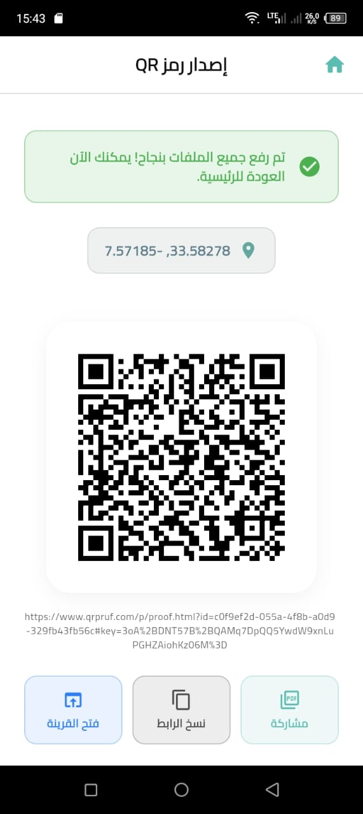
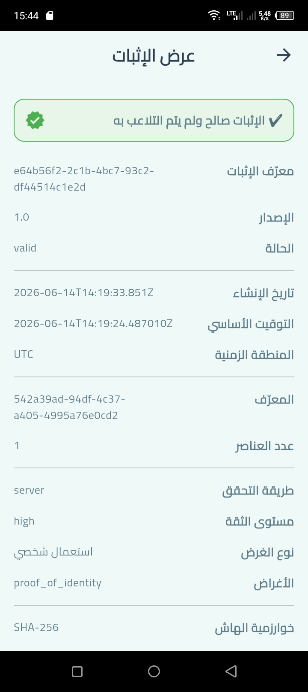

# QRPRUF — Zero-Trust Proof-of-Presence Protocol

QRPRUF is a mobile-first zero-trust proof-of-presence protocol designed to certify that a person, event, or field action happened at a specific place and time.

It generates a signed, geolocated and timestamped QR badge from a mobile device, using local evidence capture, cryptographic hashing, GPS/time validation and a verification-first architecture.

The project is part of the WITI ecosystem and was designed for high-trust field operations where presence, traceability and evidence integrity are critical.

---

## Business Problem

Many field operations still rely on manual declarations, screenshots, paper forms, phone calls or trust-based reporting to confirm that an action happened on-site.

This creates several risks:

* location spoofing;
* unverifiable attendance;
* weak audit trails;
* fragmented evidence;
* delayed reporting;
* lack of trusted proof in offline or low-connectivity environments.

QRPRUF addresses this problem by allowing a mobile device to generate a verifiable proof package locally, then synchronize it later when connectivity is available.

---

## Solution

QRPRUF provides a zero-trust mobile proof layer that combines:

* mobile identity verification;
* geolocation evidence;
* trusted timestamping logic;
* cryptographic hashing;
* QR badge generation;
* local-first proof chain;
* optional cloud synchronization;
* public or controlled verification.

Instead of trusting a user declaration, the system produces a structured proof object that can be verified independently.

---

## Product Screenshots

| Dashboard | Proof Purpose Selection | Evidence Review |
|---|---|---|
|  |  |  |

| QR Badge Generated | Proof Verification |
|---|---|
|  |  |

---

## Key Features

* Signed QR proof badge generation
* GPS-based proof-of-presence
* Timestamped local evidence capture
* On-device cryptographic hashing
* Offline-first proof creation
* Supabase integration for synchronization and storage
* Clean Architecture and feature-driven Flutter structure
* Riverpod-based state management
* Biometric/local authentication support
* Designed for field operations, LegalTech, GovTech and compliance workflows

---

## My Role

I designed and developed QRPRUF as the creator and software architect of the protocol.

My work included:

* defining the proof-of-presence architecture;
* designing the local-first proof chain;
* implementing the Flutter/Dart mobile client;
* structuring the application with Clean Architecture and feature-driven modules;
* integrating cryptographic hashing and evidence capture workflows;
* designing the Supabase synchronization layer;
* preparing the protocol for integration with the broader WITI ecosystem.

---

## Architecture Overview

QRPRUF follows a modular mobile architecture focused on maintainability, security and field reliability.

Main architectural layers:

* **Presentation Layer** — Flutter UI and user workflows
* **State Management Layer** — Riverpod providers and generated state logic
* **Domain Layer** — proof entities, use cases and validation rules
* **Service Layer** — geolocation, proof generation, storage, authentication and sync
* **Data Layer** — local proof persistence and Supabase integration
* **Verification Layer** — QR badge output and proof validation logic

The system is designed to work in offline-first environments where the proof can be generated locally and synchronized later.

---

## Security Model

QRPRUF is based on a zero-trust approach:

* evidence is captured and structured locally;
* proof data is hashed before synchronization;
* GPS and timestamp data are treated as verifiable evidence inputs;
* the QR badge acts as a portable proof reference;
* cloud synchronization does not replace local proof generation;
* sensitive secrets and runtime configuration are excluded from the public repository.

The public repository is portfolio-safe and does not contain production credentials, private keys or confidential deployment data.

---

## Tech Stack

* **Flutter / Dart**
* **Riverpod**
* **Supabase**
* **Local authentication**
* **Cryptographic hashing**
* **GPS / geolocation services**
* **Clean Architecture**
* **Feature-Driven Design**

---

## Use Cases

QRPRUF can be adapted to several high-trust scenarios:

* field agent proof-of-presence;
* legal or institutional field operations;
* certified attendance;
* delivery or service verification;
* inspection workflows;
* event check-in verification;
* technician intervention reports;
* compliance and audit trails.

---

## Repository Status

This repository is a public portfolio version of the QRPRUF project.

Some production-specific configuration, credentials, private deployment details and sensitive operational data are intentionally excluded.

---

## Related Ecosystem

QRPRUF is designed as a trust layer within the broader WITI ecosystem, which also includes:

* mobile field applications;
* institutional dashboards;
* legal workflow tools;
* proof generation and verification modules.

---

## Author

**Samir Chatwiti**
Software Architect | Flutter & Laravel Developer | LegalTech / GovTech / Zero-Trust Systems

LinkedIn: https://www.linkedin.com/in/samir-chatwiti/
GitHub: https://github.com/SamirChatwiti
Website: https://qrpruf.com
