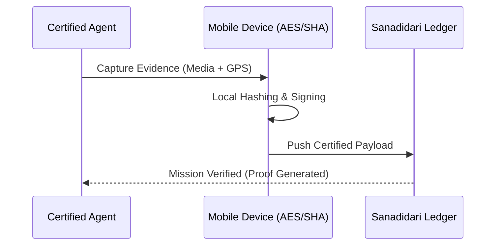

# 🛡️ WITI Certify (QRPRUF) - Universal Protocol for Proof of Presence


🔗 [Official Protocol Site](https://qrpruf.com) | [WITI Ecosystem](https://sanadidari.com/witi)

**WITI Certify** (codename: **QRPRUF**) is the high-security cryptographic flagship of the **Sanadidari Trust Ledger**. Designed for LegalTech and institutional environments, it provides iron-clad **Zero-Trust certification** of events, people, and locations. 📚 **See [ARCHITECTURE.md](ARCHITECTURE.md) for detailed engineering design.**

---

## 🏗️ Engineering Architecture & State Management

This mobile client is built using **Clean Architecture** principles and a **Feature-Driven Design** (FDD) approach, ensuring scalability and testability.

- **State Management**: **Riverpod 3.0** with Code Generation (`riverpod_generator`) for high-performance, reactive, and type-safe state handling.
- **Dependency Injection**: Provider-based DI (via Riverpod), facilitating easy mocking for unit and integration testing.
- **Local Security**: Hardware-level biometric vault integration (`local_auth`) and on-device AES/SHA-256 hashing.
- **Backend-as-a-Service**: Seamless integration with **Supabase** for real-time data persistence and edge function triggers.

### 📁 Project Structure (lib/)
- `/features`: Core business logic domains (Authentication, Certification, History).
- `/services`: Infrastructure connectors (Cloud Storage, Proof Generation, Geolocation).
- `/wassit`: Specialized internal protocol for institutional trust exchange.
- `/providers`: Global state handlers and domain logic orchestrators.

---

## 🔒 Security & Cryptographic Proof
At its core, **WITI Certify** operates on a local-first security model:
- **On-Device Hashing**: Media/Evidence is hashed locally before transmission.
- **Trusted Time & Space**: Cross-referencing between network, device, and satellite NTP/GPS to prevent spoofing.



---

## 🚀 Getting Started (Developers)

### Prerequisites
- [Flutter SDK](https://docs.flutter.dev/get-started/install) (Stable channel)
- [Dart VM](https://dart.dev/get-started/dart-sdk)
- [Supabase CLI](https://supabase.com/docs/guides/cli) (Optional, for local functions testing)

### Installation
1. Clone the repository:
   ```bash
   git clone https://github.com/sanadidari/qrpruf.git
   cd qrpruf
   ```
2. Install dependencies:
   ```bash
   flutter pub get
   ```
3. Generate code (Riverpod & Models):
   ```bash
   dart run build_runner build --delete-conflicting-outputs
   ```
4. Configure environment:
   Create a `.env` file based on `.env.example` (if provided) or configure your Supabase credentials.

---

## 🧪 Testing & CI/CD Status
- **Unit Tests**: Coverage for core services in `test/`. Run with `flutter test`.
- **CI/CD Pipeline**: Automated linting and testing via **GitHub Actions** (configured in `.github/workflows/dart_ci.yml`).

---

## 📜 License
This project is part of the **WITI Ecosystem**. License: **MIT License**.

---
*Created by @sanadidari - Chief Architect at Sanadidari SARL | High-Trust Decentralized Protocols Specialist*

